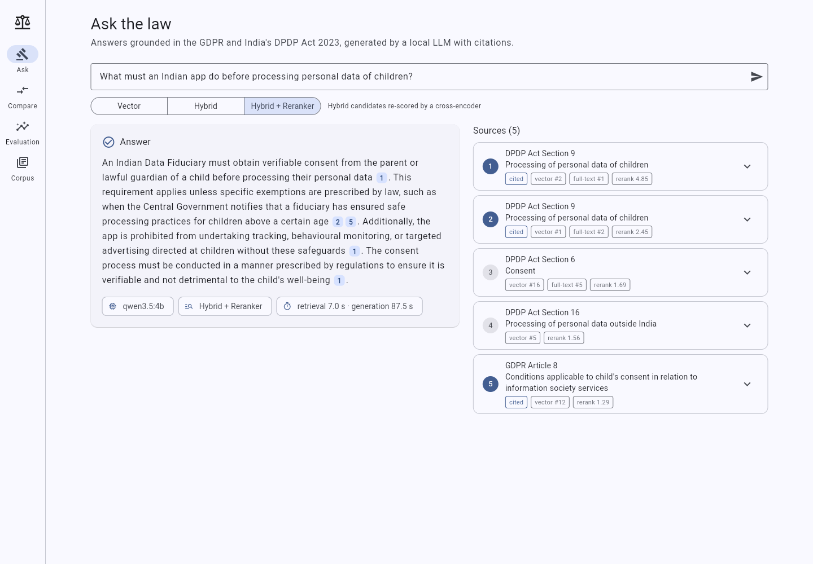
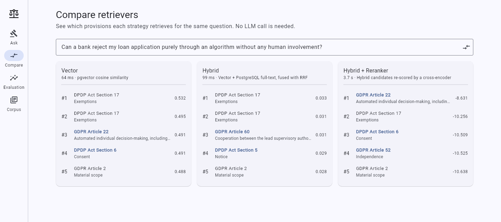
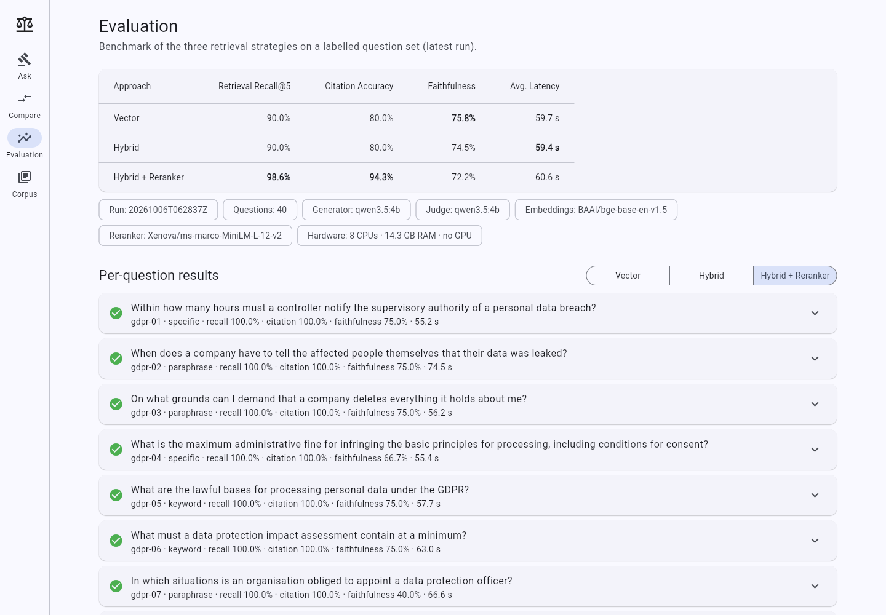
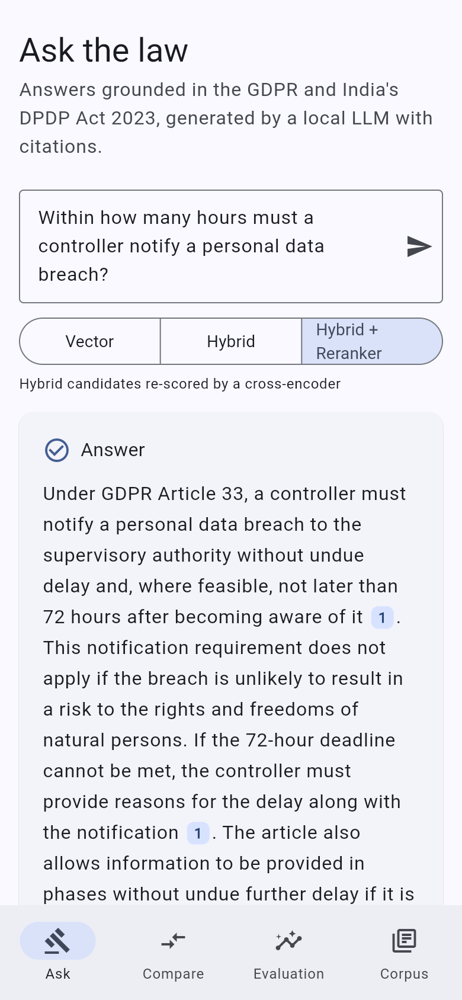
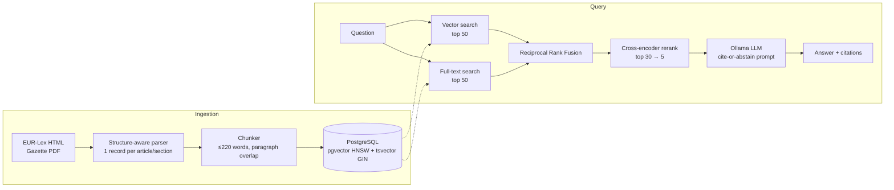

# Legal RAG + Evaluation

**Cited answers over the EU GDPR and India's DPDP Act 2023, and a benchmark that measures whether hybrid search and reranking actually help.**

[](../../actions/workflows/ci.yml)


-000000?logo=ollama&logoColor=white)




Ask a question about data-protection law and get a short answer in which every sentence cites the article or section it comes from. Sources are shown with their vector, full-text and reranker scores. When the corpus doesn't cover the question, the assistant says so instead of guessing. Everything runs locally on open-source models: no paid APIs and no GPU.

The project also answers an engineering question with data rather than assumptions: **on legal text, do hybrid search and a reranker beat plain vector search?** It does this with a labelled benchmark, ablations behind every default, and an honest error analysis.

## Highlights

- **Measured, not assumed.** A 40-question benchmark with gold provisions labelled for each question. A unit test checks every label against an evidence quote from the statute, so a mislabelled question fails CI. Metrics cover retrieval recall, citation accuracy, LLM-judged faithfulness and latency. A CI check fails if the README numbers drift from the results file.
- **Hybrid search inside one database.** pgvector (HNSW) plus PostgreSQL full-text search, fused with Reciprocal Rank Fusion. Postgres ranking has no IDF, so terms like "personal" and "data" drowned out the useful ones. A document-frequency cutoff fixed that and lifted hybrid recall from 85.7% to 90.0%.
- **Reranker chosen by benchmark.** Four open-source cross-encoders were compared. `ms-marco-MiniLM-L-12-v2` won on both accuracy (98.6% recall, 100% hit rate) and speed: about 3× faster than `bge-reranker-base` at about a tenth of the size.
- **Real-world parsing.** The DPDP Act exists only as a Gazette of India PDF, with section titles printed as marginal notes next to a Hindi masthead. The parser separates columns by word coordinates and reattaches each margin title to its section. GDPR articles come from EUR-Lex HTML.
- **Honest error analysis.** It found that the 4B model sometimes copies article paragraph numbers into citation markers (`[9]` with only 5 sources). It also found that a small self-judge rejects correct paraphrases. Both are documented below, with the next experiment for each.
- **Built like a product.** FastAPI backend, Flutter app (web and mobile, shareable deep links) and a one-command Docker Compose stack. 38 backend tests include integration tests against a real pgvector database; there are 9 Flutter widget tests, and GitHub Actions CI runs it all.

| | |
|---|---|
| **API** | Python 3.12 · FastAPI |
| **Store** | PostgreSQL 17 + pgvector (HNSW) + PostgreSQL full-text search |
| **Embeddings** | `BAAI/bge-base-en-v1.5` (ONNX via fastembed, CPU) |
| **Reranker** | `Xenova/ms-marco-MiniLM-L-12-v2` cross-encoder (ONNX, CPU) |
| **LLM** | Ollama + `qwen3.5:4b` (swap in any Ollama model) |
| **UI** | Flutter (web, Android, iOS) |
| **Ops** | Docker Compose · GitHub Actions |

## Results

<!-- EVAL:START -->
| Approach | Retrieval Recall@5 | Citation Accuracy | Faithfulness | Avg. Latency |
|---|---:|---:|---:|---:|
| Vector | 90.0% | 80.0% | **75.8%** | 59.7 s |
| Hybrid | 90.0% | 80.0% | 74.5% | **59.4 s** |
| Hybrid + Reranker | **98.6%** | **94.3%** | 72.2% | 60.6 s |

<sub>40 questions (35 answerable, 5 unanswerable) · generator `qwen3.5:4b` · judge `qwen3.5:4b` · embeddings `BAAI/bge-base-en-v1.5` · reranker `Xenova/ms-marco-MiniLM-L-12-v2` · CPU only (8 cores, 14.3 GB RAM) · run `20261006T062837Z`</sub>
<!-- EVAL:END -->

**What the numbers say**

- **The reranker is what matters.** Hybrid + Reranker finds at least one correct provision for every question (100% hit rate vs 94%). It lifts citation accuracy from 80% to 94%, and it abstains on answerable questions only 3% of the time, against 9–11% for the others. Its cost is about 3.4 s of CPU reranking per query, which is small next to roughly 57 s of generation.
- **Hybrid alone ties Vector.** Full-text search fixes exact-term questions ("72 hours", "fewer than 250", specific recall 88% → 100%) but adds noise to lay-language ones (paraphrase recall 92% → 83%). The cross-encoder is what turns the extra candidates into a gain. See [recall by question type](evaluation/results/report.md#retrieval-recall-by-question-type).
- **Faithfulness is a tie, and the absolute numbers are pessimistic.** Scores of 72–76% differ by about one question. In a spot check of 12 statements the 4B judge marked unsupported, 3 were real errors. One applied GDPR Article 45 to an Indian company; another called the DPDP Board "the Central Government's Board". At least 6 were judge false negatives: correct paraphrases whose supporting text was among the sources (e.g. Article 32's security measures, Article 34(3)'s exceptions). A larger judge (`JUDGE_MODEL=gemma4:12b`) should give truer absolute scores.
- **All three approaches abstained on all 5 out-of-scope questions.**
- **Most citation errors are dangling markers.** In 11 of 120 answers the 4B model writes things like `[9]` when it was given only 5 sources. It is copying a paragraph number (Article 28(9) → "[9]") into the citation slot. Labelling sources `[S1]…[S5]` instead of `[1]…[5]` is the obvious next experiment.
- **Latency is almost entirely the LLM** generating on 8 CPU cores. Retrieval takes 50 ms, or 3.4 s with reranking.

Metric definitions and caveats are under [Evaluation](#evaluation). Per-question results are in [`evaluation/results/report.md`](evaluation/results/report.md).

## Screenshots

| Compare retrievers on one question | Evaluation dashboard |
|---|---|
|  |  |
| On *"Can a bank reject my loan purely through an algorithm?"* vector search ranks GDPR Article 22 third, hybrid loses it to keyword noise, and the reranker puts it first. | The same benchmark as above, with a per-question explorer showing gold vs. retrieved provisions and the model's answer. |

<p align="center"></p>
<p align="center"><sub>Mobile layout. Asked without retrieval, the same 4B model gave the breach deadline as "within one month". Grounded in Article 33, it gives the correct 72 hours.</sub></p>

## Quickstart (Docker)

Clone the repository, then:

```bash
cd legal-rag
cp .env.example .env          # optional; defaults work
docker compose up --build     # first run downloads the LLM (~3 GB) and indexes the corpus
```

- UI: <http://localhost:8080>
- API docs (Swagger): <http://localhost:8000/docs>

Already running Ollama on the host? Reuse it instead of downloading the model again:

```bash
docker compose -f docker-compose.yml -f docker-compose.host-ollama.yml up --build
```

Have an NVIDIA GPU? Add `-f docker-compose.gpu.yml`.

## Local development

```bash
make setup                  # .venv + backend deps (Python 3.12)
make db                     # PostgreSQL + pgvector on localhost:5433
ollama pull qwen3.5:4b
make ingest                 # chunk + embed the bundled corpus (~2 min on CPU)
make api                    # http://localhost:8000
make web                    # Flutter app against the local API
make test                   # backend (pytest) + Flutter tests
make eval-retrieval         # retrieval-only benchmark, ~5 min, no LLM needed
make eval                   # full benchmark (retrieval + generation + LLM judge)
```

Run `make help` for every target.

## How it works



**Parsing that respects legal structure.** Each GDPR article and each DPDP section is one citable unit. The DPDP Act is published as a Gazette PDF with section titles printed as marginal notes, so the parser separates body text from the margins by word position and then attaches each note to its section. Details are in [data/README.md](data/README.md).

**Chunking.** Chunks never cross a provision boundary, prefer paragraph breaks, and carry up to 40 words of the previous paragraph as overlap. Every chunk is embedded with a citation header (`GDPR Article 33 — Notification of a personal data breach…`), which helps queries like "Article 17" and title-level matches.

**Three retrieval strategies** (`backend/app/retrieval/search.py`):

| Mode | What it does |
|---|---|
| `vector` | pgvector cosine similarity over `bge-base` embeddings (HNSW index) |
| `hybrid` | Vector top-50 + PostgreSQL full-text top-50, merged with Reciprocal Rank Fusion (k=60) |
| `hybrid_rerank` | Hybrid top-30 re-scored by a cross-encoder; keep the best 5 |

Postgres `ts_rank` has no IDF, so in a corpus about personal data the words "personal" and "data" match nearly everything. The full-text query therefore drops terms that occur in more than 20% of chunks (`FTS_MAX_DF`, an IDF-like cutoff). The [ablations](#ablations) show why.

**Generation.** The prompt gives the model numbered sources and requires a `[n]` citation on every sentence. If the sources don't contain the answer, the model must reply with a fixed abstention sentence. Decoding is deterministic (temperature 0, fixed seed) so benchmark runs are comparable. The API maps every `[n]` back to its chunk and provision and flags citation numbers that point at no source.

## Evaluation

[`evaluation/questions.json`](evaluation/questions.json) has 40 questions:

- 20 on the GDPR and 12 on the DPDP Act, mixing *keyword*, *specific* (exact numbers and deadlines) and *paraphrase* (lay language, e.g. "can a bank reject my loan purely through an algorithm?") phrasings;
- 3 *cross-document* questions comparing the two laws;
- 5 *unanswerable* questions (California contract law, English wills, …) where the right behaviour is to abstain.

Every answerable question lists its gold provisions and an **evidence quote** that must appear verbatim in them. A unit test checks each label against the corpus, so a mislabelled question fails CI.

| Metric | Definition |
|---|---|
| **Retrieval Recall@5** | Share of a question's gold provisions found in the 5 retrieved chunks, averaged over the 35 answerable questions. Scored per provision: any chunk of Article 33 counts. |
| **Citation Accuracy** | Share of answerable questions whose answer cites ≥1 gold provision and has no dangling citations (a `[n]` with no source *n*). Over-citation is reported separately as *citation precision*. |
| **Faithfulness** | An LLM judge splits each answer into sentences and checks every one against the sources the generator saw. Score = supported ÷ total, averaged over all 40 answers. An abstention makes no claim, so it scores 1.0; the cost of abstaining wrongly shows up in citation accuracy. |
| **Avg. Latency** | End-to-end wall-clock time per question (retrieval + generation) on the CPU-only machine named under the table. |

Run it yourself:

```bash
cd backend
python -m app.evaluation                    # all modes, checkpointed; --resume <file> continues a run
python -m app.evaluation --retrieval-only   # fast, no LLM
JUDGE_MODEL=gemma4:12b python -m app.evaluation   # use a different, larger judge
python ../evaluation/generate_report.py     # refresh README table + results/report.md
```

The judge runs as a second pass after all answers are generated, so Ollama swaps models once rather than once per question. CI fails if the README table drifts from `evaluation/results/latest.json`.

### Ablations

Retrieval-only experiments behind the chosen defaults ([`evaluation/results/ablations.json`](evaluation/results/ablations.json)):

**Full-text term cutoff** (`hybrid` mode):

| `FTS_MAX_DF` | Recall@5 | Hit rate | MRR |
|---|---:|---:|---:|
| 1.0 (no cutoff) | 85.7% | 88.6% | 0.788 |
| 0.3 | 90.0% | 94.3% | 0.813 |
| **0.2 (default)** | **90.0%** | **94.3%** | **0.813** |
| 0.1 | 90.0% | 94.3% | 0.766 |
| 0.05 | 94.3% | 97.1% | 0.777 |

0.05 scores highest here, but it discards most of the vocabulary. Choosing it from 35 questions would mean tuning on the test set, so the default is the conservative 0.2.

**Reranker** (`hybrid_rerank`, `FTS_MAX_DF=0.2`, 30 candidates, CPU):

| Model | Size | Recall@5 | Hit rate | MRR | Retrieval latency |
|---|---:|---:|---:|---:|---:|
| **`Xenova/ms-marco-MiniLM-L-12-v2`** | 0.12 GB | **98.6%** | **100%** | **0.913** | 3.5 s |
| `BAAI/bge-reranker-base` | 1.04 GB | 92.9% | 94.3% | 0.800 | 9.9 s |
| `jinaai/jina-reranker-v1-turbo-en` | 0.15 GB | 87.1% | 88.6% | 0.809 | 2.1 s |
| `jinaai/jina-reranker-v1-tiny-en` | 0.13 GB | 88.6% | 91.4% | 0.772 | 1.3 s |

### Caveats

- **Small benchmark.** 40 questions can rank the approaches, but a 3-point difference is about one question. Treat close numbers as ties.
- **Self-judging with a small model.** By default the generator (`qwen3.5:4b`) also judges faithfulness. In this run it was noisy rather than lenient: it rejected several correct paraphrases (see above). Treat faithfulness as a relative signal between approaches. Setting `JUDGE_MODEL` to a larger model (e.g. `gemma4:12b`) gives an independent judge at roughly 3× the judging time.
- **Latency is hardware-bound.** Numbers come from a CPU-only laptop. Generation dominates; on a GPU the same pipeline answers in a few seconds.
- **Not legal advice.** This is a retrieval and evaluation demo, not a substitute for a lawyer.

## API

| Method | Path | Purpose |
|---|---|---|
| `POST` | `/ask` | `{"question", "mode", "top_k"}` → answer, citations, sources, timings |
| `POST` | `/search` | Retrieval only: same input, ranked sources with vector/full-text ranks and rerank score |
| `GET` | `/documents` | Indexed documents with provision and chunk counts |
| `POST` | `/documents` | Upload PDF/HTML/TXT/MD (multipart: `file`, `title`, `short_name`) |
| `DELETE` | `/documents/{id}` | Remove a document and its chunks |
| `GET` | `/evaluation/latest` | Latest benchmark summary and per-question records (feeds the UI dashboard) |
| `GET` | `/health` | Database, Ollama and model status |

```bash
curl -s localhost:8000/ask -H 'Content-Type: application/json' \
  -d '{"question": "What is the maximum penalty under the DPDP Act for a data breach?", "mode": "hybrid_rerank"}'
```

## Flutter app

Four tabs, all responsive (navigation rail on wide screens, bottom bar on phones):

- **Ask:** pick a retrieval mode and get an answer with tappable citation chips; each chip scrolls to and highlights its source. Each source shows its vector rank, full-text rank and rerank score.
- **Compare:** runs one query through all three retrievers side by side and bolds the provisions only one retriever found. It does no generation, so it's fast.
- **Evaluation:** the benchmark table plus a per-question explorer.
- **Corpus:** system health and the indexed documents.

Every view can be opened from a link: `/?q=<question>&mode=hybrid` asks a question, `/?tab=compare&q=<question>` compares the retrievers and `/?tab=evaluation` opens the dashboard. That makes answers shareable, and the README screenshots are captured that way.

The Docker image serves the web build through nginx, which proxies `/api` to FastAPI (same origin, so no CORS). For mobile or desktop builds, pass the API URL: `flutter run --dart-define=API_BASE_URL=http://10.0.2.2:8000` (that address reaches the host from the Android emulator).

## Configuration

Every setting is an environment variable with a working default. See [`.env.example`](.env.example). The ones you're most likely to change:

| Variable | Default | Notes |
|---|---|---|
| `OLLAMA_MODEL` | `qwen3.5:4b` | Any Ollama chat model. Reasoning models run with thinking disabled. |
| `JUDGE_MODEL` | *(generator)* | Faithfulness judge |
| `EMBEDDING_MODEL` / `EMBEDDING_DIM` | `BAAI/bge-base-en-v1.5` / 768 | Changing these requires `ingest --reset` (enforced at startup) |
| `RERANKER_MODEL` | `Xenova/ms-marco-MiniLM-L-12-v2` | Any fastembed cross-encoder |
| `TOP_K`, `RERANK_CANDIDATES`, `FTS_MAX_DF` | 5, 30, 0.2 | Retrieval knobs |

## Deployment and cost

**Cost: $0.** Every component is open source and runs on your own machine; `docker compose up` is the reference deployment.

Hosting it publicly within free tiers is mostly blocked by the LLM:

- Free PaaS tiers (Render, Railway trials, Fly.io) give ≤1 GB of RAM. That's enough for the API and Postgres, but not for a 4B-parameter model, which needs about 4 GB.
- **Oracle Cloud Always Free** (4 Arm cores, 24 GB RAM) *can* run the whole Compose stack, at CPU speed. It requires a card for identity verification, but it's never charged on the Always Free shapes.
- The Flutter web build is static and can be served for free from GitHub Pages or Cloudflare Pages. It still needs a reachable API, so set `API_BASE_URL` when building.

## Project structure

```
legal-rag/
├── backend/
│   ├── app/
│   │   ├── api/            # FastAPI routes + schemas
│   │   ├── ingestion/      # download → parse → chunk → embed → store
│   │   ├── retrieval/      # embedder/reranker models, vector / hybrid / rerank search
│   │   ├── generation/     # Ollama client, cite-or-abstain prompt, citation parsing
│   │   ├── evaluation/     # metrics, LLM judge, benchmark runner (python -m app.evaluation)
│   │   ├── config.py, db.py
│   │   └── main.py
│   ├── tests/              # unit + integration (real pgvector, fake LLM, hashing embedder)
│   └── requirements.txt
├── frontend/flutter_app/   # Flutter UI (+ Dockerfile, nginx.conf)
├── data/                   # sources.json, parsed corpus (JSONL), README
├── docs/screenshots/       # README images, captured from the running app
├── evaluation/
│   ├── questions.json      # 40 labelled questions with evidence quotes
│   ├── results/            # latest.json, report.md, ablations.json
│   └── generate_report.py  # renders the README table (stdlib only)
├── docker-compose.yml      # + host-ollama and gpu overrides
├── Dockerfile              # backend image (models baked in)
├── Makefile
└── .env.example
```

## Testing

- **Backend:** 38 pytest tests. Unit tests cover parsers, chunking, citation parsing, metrics, the judge and RRF. Integration tests run against real PostgreSQL + pgvector: every retrieval mode, every API endpoint including upload/delete, and an end-to-end evaluation run. Integration tests use a deterministic hashing embedder and a fake LLM, so CI downloads no models.
- **Frontend:** 9 Flutter tests covering the ask flow, citation parsing, mode switching, deep links, the evaluation table, the compare view and API error handling.
- **CI** (`.github/workflows/ci.yml`): ruff, pytest against a pgvector service container, the README table check, `flutter analyze`/`test`/`build web`, Compose validation and a backend image build.

## Roadmap

Next experiments, in order of expected impact:

1. **Unambiguous source labels** (`[S1]…[S5]`) to stop paragraph numbers leaking into citations. This was the largest source of citation errors.
2. **An independent judge** (`gemma4:12b`), to separate real hallucinations from judge noise in faithfulness.
3. **Query decomposition for cross-document questions.** Comparisons of the two laws are the weakest category, at 83% recall even with the reranker.
4. **Streaming answers** to the UI, so CPU-bound generation feels responsive.
5. **More statutes:** India's IT Act 2000 and the DPDP Rules, and the CCPA. The parser and `sources.json` are built for this.

## Data and licence notes

The GDPR text is © European Union, reused under Commission Decision 2011/833/EU. The DPDP Act is an Act of the Indian Parliament, reproducible under s. 52(1)(q) of the Copyright Act, 1957. See [data/README.md](data/README.md).
